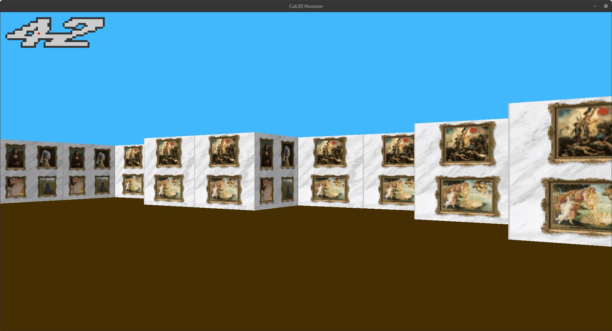

## :warning: Disclaimer

[ :uk: ] Please do not copy-paste this code. In this way, you won't learn a lot. Instead, you can use it to understand how to do some tricky part, but try to redo it by your own.
Just to let you know, some files may be incorrect. Some bugs may have passed through, or subject may have changed since I did this project.

[ :fr: ] S'il vous plait, ne copier-coller pas ce code. De cette manière, vous n'apprendrez pas grand chose. A la place, vous pouvez l'utiliser pour comprendre certaines parties plus complexes du sujet, mais essayez de le refaire par vos propres moyens.
Pour information, certains exercices pourraient être incorrects. Quelques bugs pourraient avoir réussi à passer au travers les mailles du filet, ou le sujet a peut-être changé depuis que j'ai complété le projet.

---
# 42-CommonCore_05.2025_Cub3D



The goal of this project is to create a graphical 3D program using a 2D map and raycasts. The use of raycasting is mandatory to simulate a 3D image on a 2D screen.

As many people usually make a game, with my pair we decided to turn ours into a museum.

This project is the last C project in the common core.

## Usage

First, make the mlx:

```bash
make mlx
```

Then make the project:

```bash
make
```

Finally, launch the game with the map of your choice:

```bash
./cub3D [map_path.cub]
```

## Map tester

There is a script (`test_map.sh`) in the project to check every invalid maps. To use it:

1.  Make file executable:

    ```bash
    chmod +x test_map.sh
    ```

2.  Remove permissions from texture file `no_perm.xpm` (mandatory to test texture permission error like in `map/inv20_no_texture_permission.cub`):

    ```bash
    chmod -r textures/no_perm.xpm
    ```

3.  Execute script:

    ```bash
    ./test_map.sh
    ```

4.  If you want to test with valgrind:

    ```bash
    ./test_map.sh --valgrind
    ```

## Controls

* Moving:
    * `W` : Forward
    * `A` : Right
    * `S` : Backward
    * `D` : Left
* Camera rotation:
    * Left/Right arrows or mouse mouvement
* Quit:
    * `ECHAP` or window cross

_Common Core Rank 04 - Completed in May 2025_  
_Code by [nicolmar](https://github.com/Nico-Mar42) and me_
